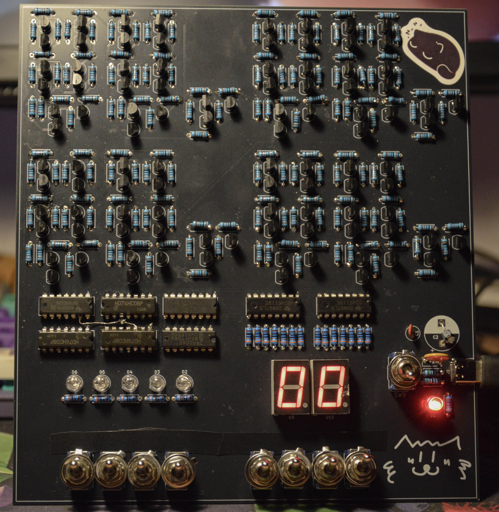
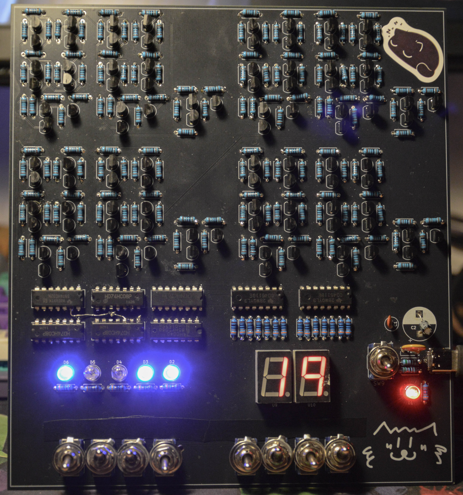
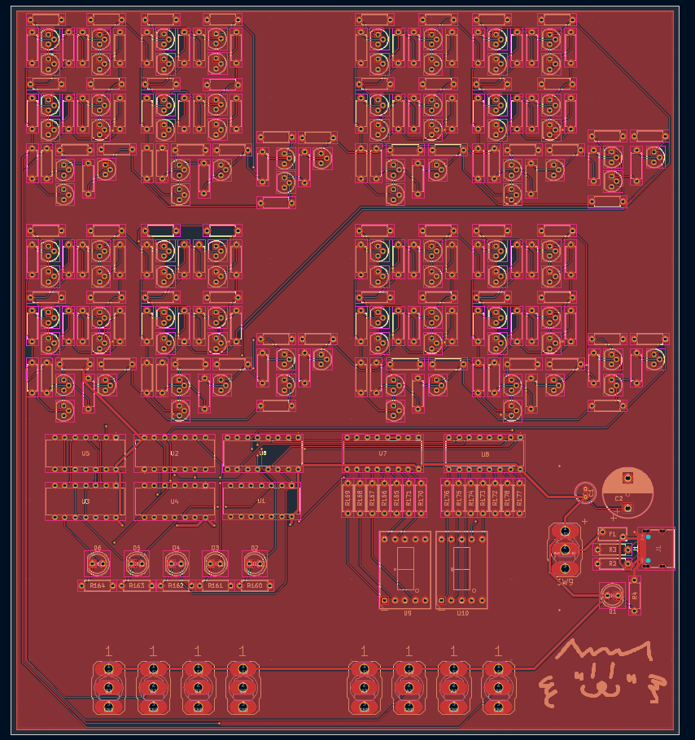
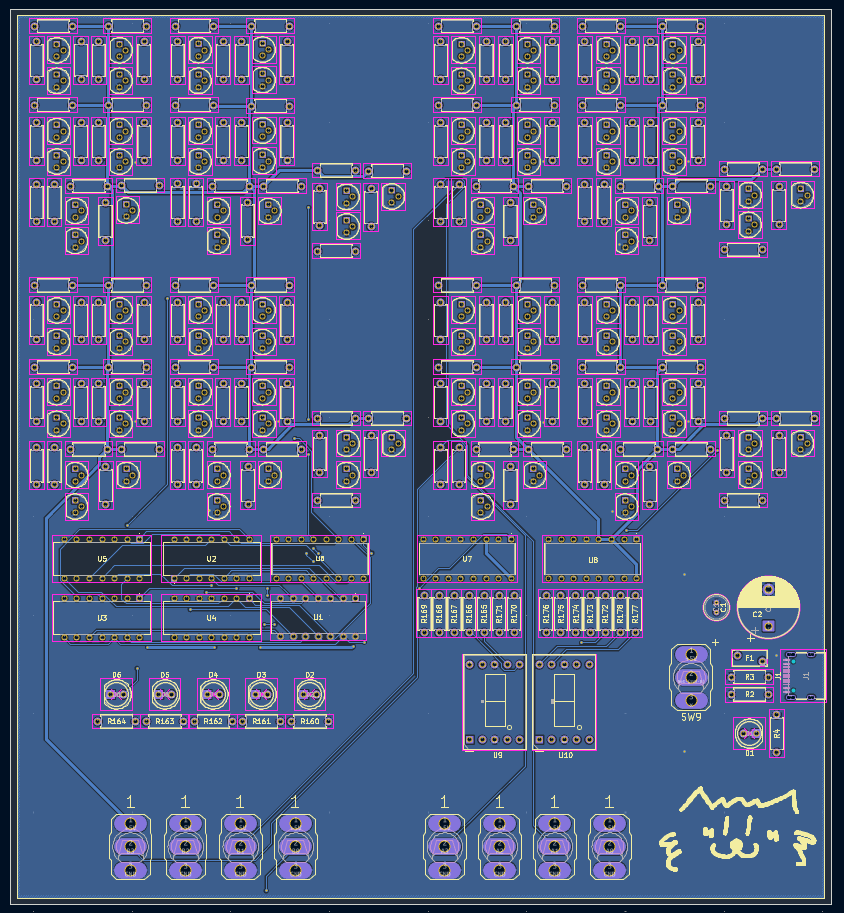
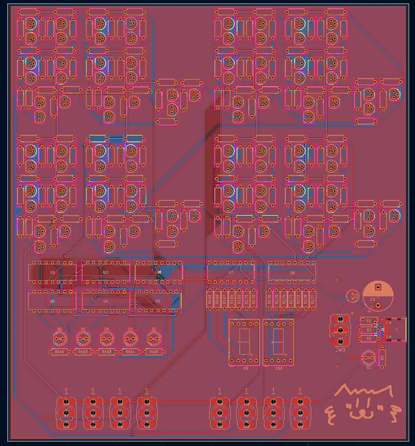
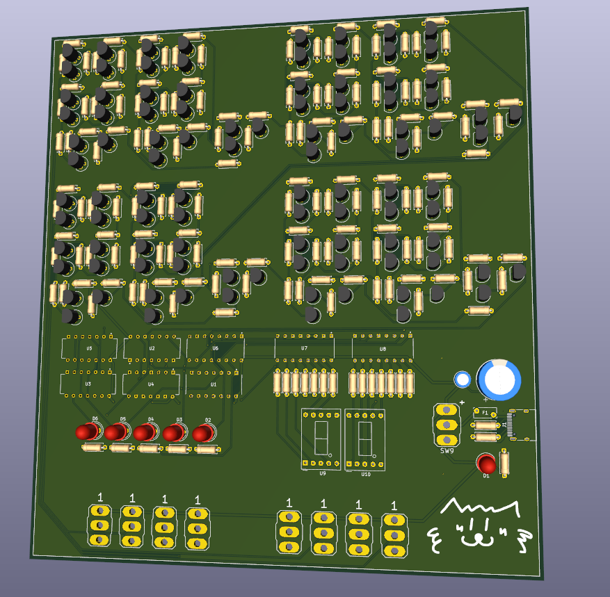
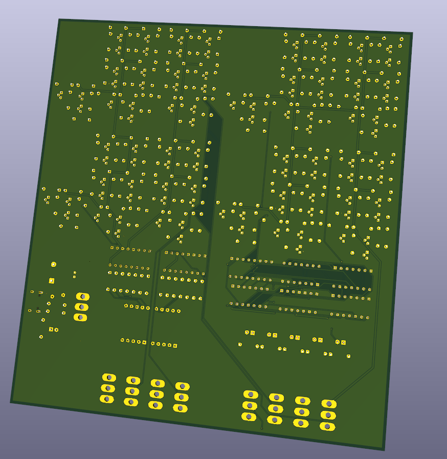
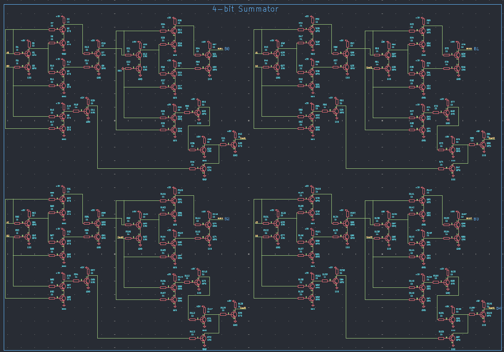
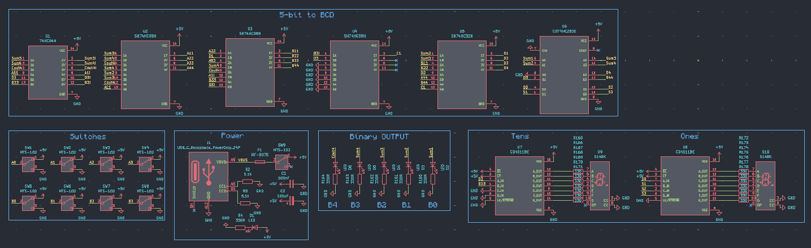

# 4-Bit Transistor Adder
A fully functional **4-bit binary adder** built using discrete transistor-resistor logic and standard 74HC-series logic ICs.
The project was developed from the initial logic design and transistor-level simulation to a custom two-layer PCB, PCB manufacturing, component assembly, and hardware testing.
The final circuit accepts two 4-bit binary numbers, adds them together, converts the resulting 5-bit value into decimal digits, and displays the result on two 7-segment displays.


## Overview
The main goal of this project was to design and build a physical digital calculator without relying on a microcontroller for the main arithmetic logic.
The core 4-bit adder was developed using **discrete transistor-resistor logic**.
The project includes:
- 4-bit binary addition
- Discrete transistor-based logic
- 5-bit binary result
- Binary-to-BCD conversion
- Two 7-segment displays
- CD4511 BCD-to-7-segment drivers
- Manual binary input using switches
- LED indicators for the binary result
- Custom two-layer PCB
- Complete KiCad schematic
- PCB design and Gerber manufacturing files
- Interactive Bill of Materials
- Falstad and Tinkercad simulations


## Specifications
| Parameter | Value |
|-----------|-------|
| Operation | 4-bit + 4-bit binary addition |
| Input A | 4 bits |
| Input B | 4 bits |
| Result | 5 bits |
| Result range | 0–30 |
| Supply voltage | 5 V |
| Power input | USB-C |
| PCB | 2-layer |
| PCB size | 166.37 × 181.61 mm |
| Main transistor | BC337-25 |
| Transistors | 100 |
| Resistors | 178 |
| 7-segment displays | 2 |
| BCD drivers | 2 × CD4511 |
| Binary input switches | 8 |
| LEDs | 6 |
| Microcontroller | None |


## How It Works

Two 4-bit binary values are entered using eight switches:
```text
A3 A2 A1 A0
B3 B2 B1 B0
```
The values are added together by the transistor-based logic, producing a 5-bit result:
```text
S4 S3 S2 S1 S0
```
The maximum possible result is:
```text
1111₂ + 1111₂ = 11110₂
```
which corresponds to:
```text
30₁₀
```
The 5-bit result is then converted into BCD:
```text
        5-bit Binary Result
                  │
                  ▼
          Binary-to-BCD
           Conversion
                  │
          ┌───────┴───────┐
          ▼               ▼
      Tens BCD         Ones BCD
          │               │
          ▼               ▼
       CD4511           CD4511
          │               │
          ▼               ▼
      7-Segment        7-Segment
       Display           Display
```
For example:
```text
10101₂ = 21₁₀
```
The two displays therefore show:
```text
21
```


## Hardware

### Final Board




## PCB Design

The PCB was designed in **KiCad** as a two-layer board.

### Front Side



### Back Side



### All Copper Layers



### 3D Model



## Schematic
The complete schematic was designed in KiCad and contains the transistor-based adder, logic ICs, BCD conversion, display drivers, inputs, indicators, and power circuitry.


A PDF version of the schematic is included in the `schematic` directory.
[**Open Schematic PDF**](schematic/sch.pdf)


## Bill of Materials

An **Interactive BOM** generated from KiCad is included in the repository.
It provides:
- Component references
- Component values
- Footprints
- Quantities
- Front and back PCB views
- Component locations
[**Open Interactive BOM**](bom/calculator-BOM.html)


## Simulation

Simulation was an important part of the development process.
Two different simulation environments were used for different stages of the project.

### Falstad
Falstad was used to learn and develop the transistor-based logic from the ground up.
The 4-bit adder was built step by step, starting from transistor-level digital logic and gradually combining the individual stages into a complete working 4-bit adder.
A downloadable Falstad simulation file is also included in the repository.
[**Open Simulation Documentation**](simulation/README.md)


### Tinkercad
Tinkercad was used to verify the digital logic and binary-to-BCD conversion.
The interactive Tinkercad simulation can be accessed through the simulation documentation.


## Development Process

The project was developed through the following stages:
```text
Concept
   ↓
Logic Design
   ↓
Transistor-Level Development
   ↓
Falstad Simulation
   ↓
Working 4-Bit Adder
   ↓
Tinkercad Simulation
   ↓
KiCad Schematic
   ↓
PCB Layout
   ↓
PCB Manufacturing
   ↓
Component Assembly
   ↓
Hardware Testing
```
The purpose of this workflow was to validate the logic progressively before moving to the final physical implementation.

## Manufacturing Files

The repository contains the files required to reproduce the PCB.
The `pcb` directory includes:
- KiCad PCB files
- Gerber manufacturing files
The schematic directory contains the KiCad schematic and PDF documentation.


## Repository Structure
```text
4-Bit-Transistor-Adder/
│
├── 📁 bom/
│   └── Interactive BOM
│
├── 📁 images/
│   ├── Project photos
│   ├── PCB renders
│   ├── PCB layers
│   ├── Schematic images
│   └── Simulation screenshots
│
├── 📁 pcb/
│   ├── KiCad PCB files
│   └── Gerber files
│
├── 📁 schematic/
│   ├── KiCad schematic
│   └── Schematic PDF
│
├── 📁 simulation/
│   ├── README.md
│   └── Falstad simulation file
│
└── README.md
```

# Tools Used
- **KiCad** — schematic and PCB design
- **Falstad Circuit Simulator** — transistor-level logic development
- **Tinkercad Circuits** — digital logic simulation
