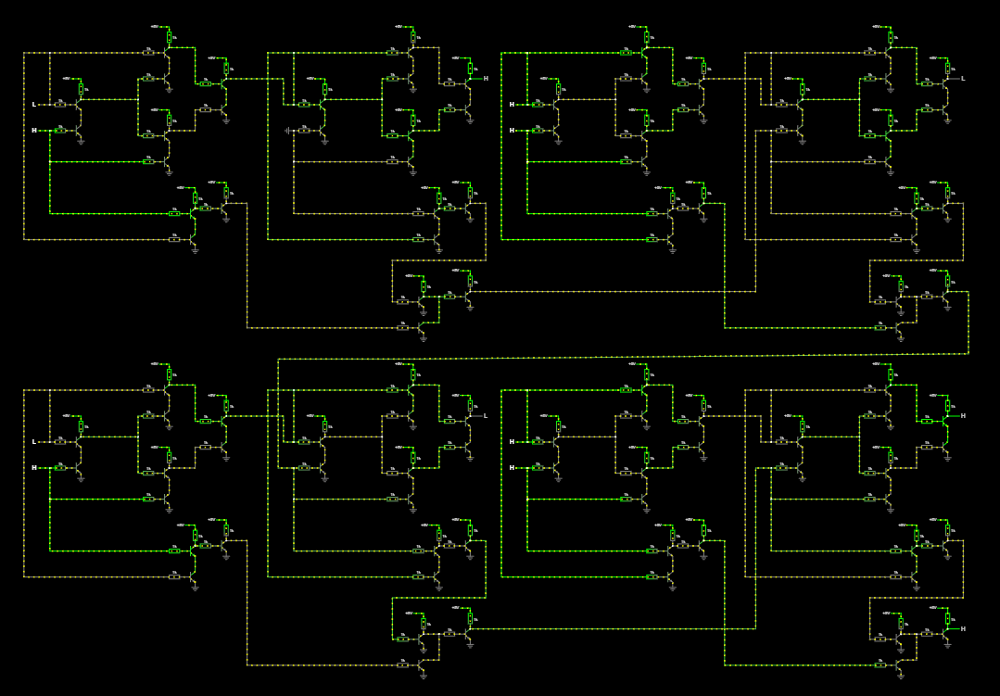
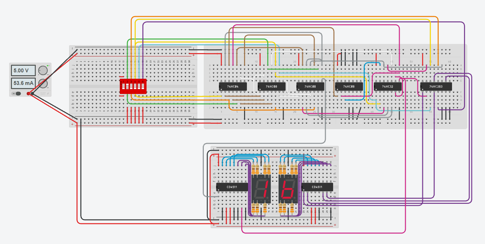

# Simulation
This folder contains the circuit simulations used during the development of the project.
The simulations were created to study, verify, and test the digital logic before moving to the final schematic and PCB implementation.
Two simulation environments were used during the development process:
- **Falstad Circuit Simulator** — used to learn and develop the transistor-based 4-bit adder from the ground up.
- **Tinkercad Circuits** — used to verify the binary-to-BCD conversion and the final digital logic.


## Overview
The final circuit takes a **5-bit binary input** and converts it into a decimal value displayed on two 7-segment displays.
The binary input is provided using DIP switches. The logic circuit processes the input and produces the corresponding BCD representation for the:
- **Tens digit**
- **Ones digit**
Two **CD4511** BCD-to-7-segment decoder/drivers are used to control the displays.


## Circuit
The simulation contains the following main functional blocks:
```text
          5-bit Binary Input
                 │
                 ▼
        ┌──────────────────┐
        │ Digital Logic    │
        │                  │
        │ 74HC04           │
        │ 74HC08           │
        │ 74HC32           │
        │ 74HC283          │
        └────────┬─────────┘
                 │
                 ▼
          BCD Conversion
                 │
          ┌──────┴──────┐
          ▼             ▼
       Tens BCD      Ones BCD
          │             │
          ▼             ▼
      CD4511          CD4511
          │             │
          ▼             ▼
     7-Segment       7-Segment
      Display         Display
```


## Components Used

### Logic ICs
| Component | Function |
|-----------|----------|
| 74HC04 | NOT gates |
| 74HC08 | AND gates |
| 74HC32 | OR gates |
| 74HC283 | 4-bit binary adder |
| CD4511 | BCD-to-7-segment decoder/driver |


### Other Components
- 2 × 7-segment displays
- DIP switches for binary input
- Current-limiting resistors
- 5 V power supply


# Falstad Simulation
Falstad was the first simulation environment used during the development of the project.
Instead of starting with a complete circuit, the 4-bit adder was developed **from the ground up** using discrete transistor-resistor logic.
The main purpose of this stage was to understand how digital logic gates can be constructed from individual transistors and how these gates can be combined to perform binary addition.

## Learning and Development Process
The development in Falstad followed several stages:
```text
Transistor Basics
       ↓
Logic Gates
       ↓
Half Adder
       ↓
Full Adder
       ↓
4-Bit Adder
```
The circuit was built step by step while testing the behavior of each stage.
The final result was a **fully working 4-bit binary adder** implemented using discrete transistor logic.


## 4-Bit Adder
The completed Falstad simulation contains four 1-bit addition stages connected together to form a 4-bit binary adder.
Each stage processes:
```text
A
B
Cin
```
and produces:
```text
Sum
Cout
```
The carry output of each stage is passed to the next bit.
```text
        ┌─────────────┐
A0 ────►│             │
B0 ────►│  1-Bit      │───► S0
Cin ───►│  Adder      │
        └──────┬──────┘
               │ Cout
               ▼
        ┌─────────────┐
A1 ────►│             │
B1 ────►│  1-Bit      │───► S1
C1 ────►│  Adder      │
        └──────┬──────┘
               │ Cout
               ▼
              ...
```
The completed 4-bit adder was then used as the basis for the hardware implementation.


## Falstad Simulation


### Simulation File
[**Download the Falstad Simulation File**](Summator4bit.txt)
After downloading the file, open it in Falstad to view the complete circuit and inspect how the transistor-based logic works.


# Tinkercad Simulation
The Tinkercad simulation was created to verify the digital logic and the binary-to-BCD conversion before moving to the final schematic and PCB implementation.
The simulation uses standard logic ICs to process the binary input and generate the corresponding BCD output.

## Input
The input is selected using five DIP switches:
```text
B4 B3 B2 B1 B0
```
Each switch represents one bit of the binary input.
The 5-bit input can represent values from:
```text
00000₂ = 0₁₀
```
to:
```text
11111₂ = 31₁₀
```
For example:
```text
Input: 10101₂
```
represents:
```text
21₁₀
```


## Output
The resulting binary value is converted into BCD and split into two decimal digits:
```text
          5-bit Binary
                │
                ▼
        ┌───────────────┐
        │ BCD Conversion│
        └───────┬───────┘
                │
       ┌────────┴────────┐
       ▼                 ▼
   Tens BCD           Ones BCD
       │                 │
       ▼                 ▼
    CD4511             CD4511
       │                 │
       ▼                 ▼
  7-Segment          7-Segment
    Display            Display
```
For example:
```text
Binary: 10101₂

Decimal: 21₁₀

Tens BCD:
0010

Ones BCD:
0001
```
The two 7-segment displays therefore show:
```text
21
```


## Simulation Screenshot
The following image shows the complete simulated circuit in Tinkercad:



## Interactive Simulation
The complete interactive simulation is available on Tinkercad:
[**Open Tinkercad Simulation**](https://www.tinkercad.com/things/4N6F5v3ThxK-5-bit-to-bcd-double-dabble)
The simulation can be used to change the binary input and observe the corresponding decimal output on the two 7-segment displays.


# Verification
The simulations were used to verify different parts of the project before moving to the physical implementation.

### Falstad
The Falstad simulation was used to:
- Learn transistor-based digital logic
- Build and test logic gates
- Develop a 1-bit adder
- Combine multiple stages into a 4-bit adder
- Verify carry propagation
- Develop the core transistor-based adder logic

### Tinkercad
The Tinkercad simulation was used to:
- Verify the 5-bit binary input
- Test the digital logic
- Verify binary-to-BCD conversion
- Test the tens digit generation
- Test the ones digit generation
- Verify CD4511 decoder operation
- Verify the 7-segment display output
Different input combinations were tested to ensure that the displayed decimal value matched the expected result.


# Development Process
The simulations were part of the overall hardware development process:
```text
Logic Design
     ↓
Falstad
     ↓
Transistor-Based 4-Bit Adder
     ↓
Tinkercad
     ↓
Binary-to-BCD Logic
     ↓
KiCad Schematic
     ↓
PCB Design
     ↓
PCB Manufacturing
     ↓
Component Assembly
     ↓
Hardware Testing
```
The simulation stage made it possible to develop and verify the logic before committing to the final PCB implementation.


# Related Project Files
The project repository contains the complete design files, including:
```text
📁 bom/
📁 images/
📁 pcb/
📁 schematic/
📁 simulation/
```
The `images` folder contains screenshots and photographs from the development process.
The `simulation` folder contains this documentation.
---

[**Back to Main README**](../README.md)
